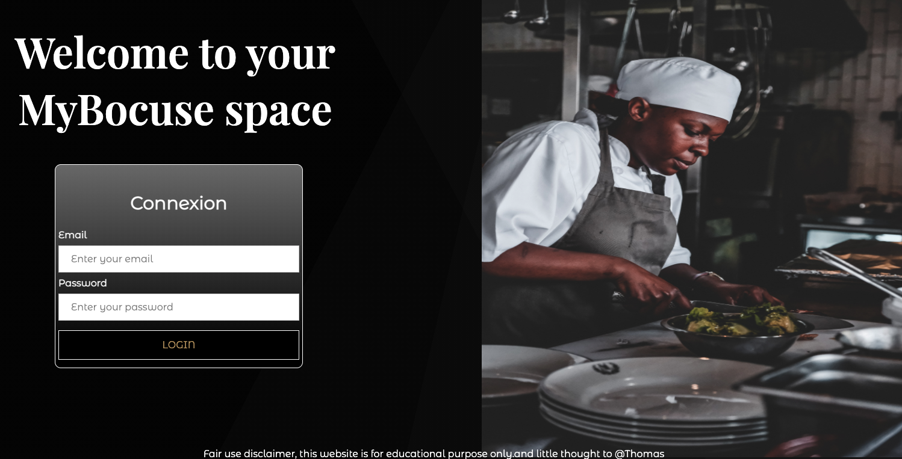

# MyBocuse Page

## Team project with
*   [Joelle Everaert](https://github.com/Joelle-Everaert)
* [Sifedine Hajji](https://github.com/Sifedine-Hajji/)
* [Fabry Jean](https://github.com/JeanFabry)
* [Bourgeois Thomas](https://github.com/ThomasBour)

Start date : 11/01/2021
End date : 14/01/2020

## What is this ?
It is a work as part of our training at **[BeCode](https://becode.org)**.  

The MyBocus site is a platform for Bocus Academy apprentices and chefs. 
It allows apprentices to notify that they are present. 
They can also enter recipes to be presented during their course.  
They also have a private member area with their personal information.  

## Context  
This group project is a consolidation project, meant to make us work both our frontend skills & what we learned so far about backend (PHP) and databases (mySQL). 
We divided the work into two groups. A front team, a backend team.
We used a trello to keep each other informed of each other's progress and held briefings 3 times a day. 
Of course, the chef of the academy have a different interface (they are chef :wink: )

## Languages used?
* HTML
* CSS
* Javascript
* PHP
* mySQL
* Website HOST
*  [Instructions](https://github.com/becodeorg/bxl-hopper-1-25/tree/master/The%20Mountain/12.PHP/0.Projects/3.mybocuse)
    
## Overview 

## Website HOST
We use Planet Hoster  
Click here to access at 
[MyBocus](https://joelle-login-page.go.yo.fr/index.php)
 

DISCLAIMER - fair use, this exercice is for educational purpose only.